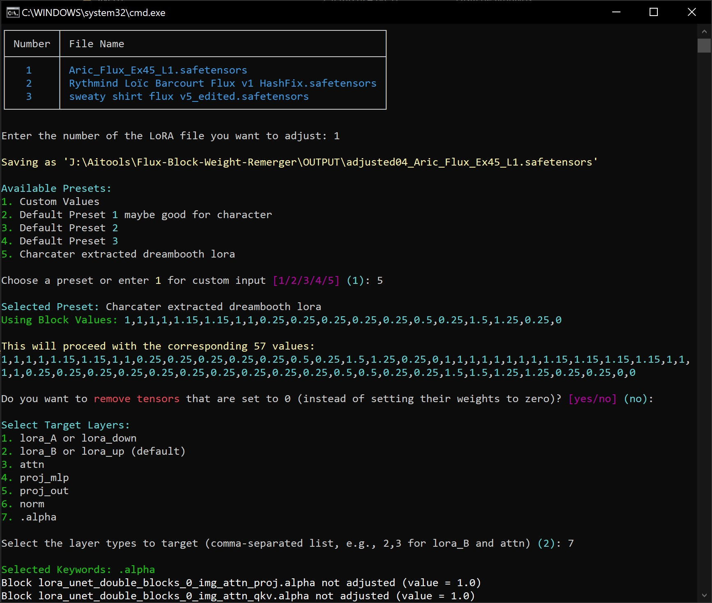

# Flux-Block-Weight-Remerger

A Python tool to filter, adjust, and optionally remove Flux block weights from a LoRA.

> **Note:** I'm not a dev, so this implementation might be wrong. It's all basically ChatGPT being guided.

 

## Features

- **Adjust Weights:** Adjust weights for blocks and layers according to provided values (19 or 57 comma separated format).
- **Zero-out Weights:** Optionally remove layers that have their weights set to zero.
  > I don't know if removing leads to problems. It defaults to keep all layers.
- **Filter Layers:** Select and adjust specific layers based on keywords: 'lora_B', 'lora_A', 'proj_mlp', 'proj_out', 'attn', 'norm' - the default is all 'lora_B' layers.
  > I have no idea if this is correct, but it's what gave me in my testings the closest result to changing the block weights in Forge or ComfyUi.

## Installation

1. **Clone the Repository**:
   ```bash
   git clone https://github.com/diodiogod/Flux-Block-Weight-Remerger
   cd Flux-Block-Weight-Remerger
   ```

2. **Set Up a Virtual Environment**:
   Make sure you have Python 3.x installed. Then, create and activate a virtual environment:
   ```bash
   python -m venv venv
   venv\Scripts\activate
   ```

4. **Install Dependencies**:
   Install the required Python packages:
   ```bash
   pip install -r requirements.txt
   ```

## Usage

1. **Prepare Your LoRA Files**:
   Place your safetensors LoRA files in the `INPUT` folder, you can leave multiple LoRas there. The processed file will be saved in the `OUTPUT` folder.

2. **Run the Script**:
   Execute the script with the necessary arguments:
   ```bash
   py adjust_tensors.py
   ```
